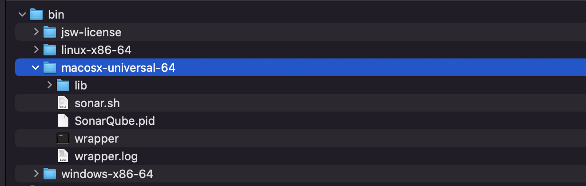

# iOS代码分析SonarQue平台搭建

###  1. 下载sonarqube 这里选择 [8.x](https://binaries.sonarsource.com/Distribution/sonarqube/sonarqube-8) 



```shell
./sonar.sh restart
```

#### 2. 需要安装JAVA11

```shell

https://www.oracle.com/java/technologies/downloads/#java11

```

#### 3. 安装Sonar-scranner命令行工具

```shell
brew install sonar-scanner
```

#### 4. 安装xcpretty

```shell
git clone https://github.com/Backelite/xcpretty.git
cd xcpretty
git checkout fix/duration_of_failed_tests_workaround
gem build xcpretty.gemspec
sudo gem install --both xcpretty-0.3.0.gem
```

##### 5. 生成compile_commands.json文件

```shell
xcodebuild -scheme $myscheme \
-workspace $myworkspace \
-configuration Debug \
-destination 'generic/platform=iOS' \
COMPILER_INDEX_STORE_ENABLE=NO \
| xcpretty \
-r json-compilation-database \
-o compile_commands.json
```

#### 6. 生成报告

> 注意-i是指定目录，-e是排除目录 -report-type pmd 才可以被正常解析。

```shell
oclint-json-compilation-database \
    -i MZAudio/Home/controller \
    -e Pods \
    -- -report-type pmd \
    -o sonar-reports/oclint.xml \
    -rc LONG_LINE=200 \
    -disable-rule ShortVariableName \
    -disable-rule ObjCAssignIvarOutsideAccessors \
    -disable-rule AssignIvarOutsideAccessors \
    -max-priority-1=100000 \
    -max-priority-2=100000 \
    -max-priority-3=100000
```

#### 7.上传到sonarque平台

1. 生成sonar-project.properties文件

   ```shell
   sonar.projectKey=baird_test
   sonar.projectName=MZAudio
   sonar.language=objc
   sonar.projectBaseDir=../../
   sonar.sources=./MZAudio
   sonar.objectivec.workspace=xxx.workspace
   sonar.objectivec.appScheme=xxx
   sonar.sourceEncoding=UTF-8
   # sonar.junit.reportsPath=sonar-reports/
   # sonar.objectivec.oclint.report=sonar-reports/oclint.xml
   sonar.inclusions=**/*.m,**/*.h
   sonar.login=admin
   sonar.password=baird
   ```

2. 执行 sonar-scanner 即可

